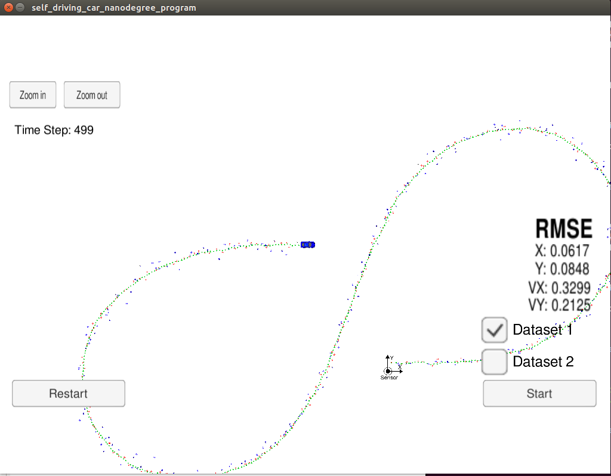
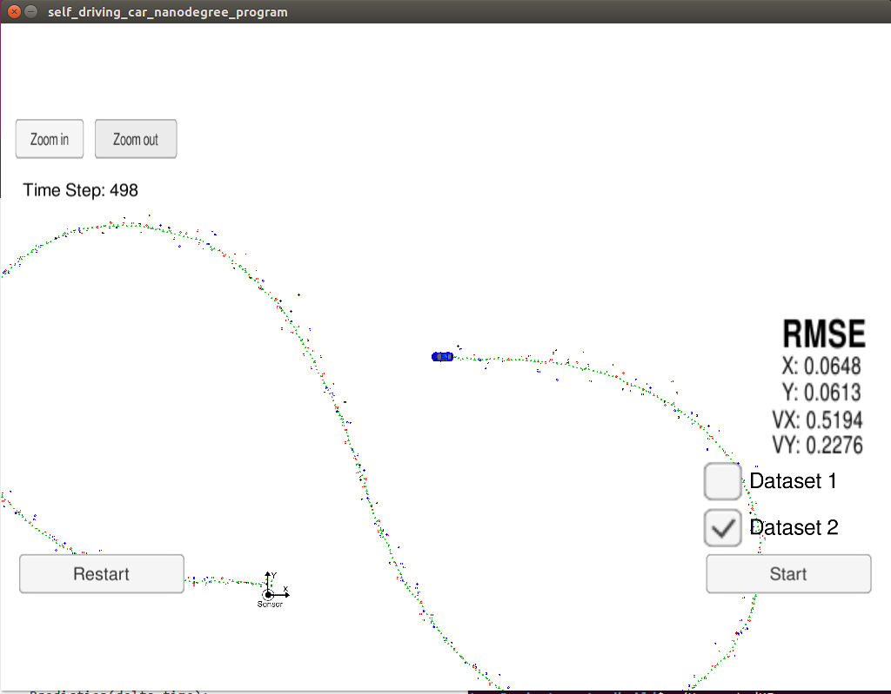

# Unscented Kalman Filter Project

## Objective

In this project, unscented kalman filter is used to estimate the state of a moving object of interest with noisy lidar and radar measurements. It involves
 
	* initialization
	* prediction
	* measurement update

The extended Kalman filter uses the Jacobian matrix to linearize non-linear functions. The unscented Kalman filter, on the other hand, does not need to linearize non-linear functions; instead, the unscented Kalman filter takes representative sigma points from a Gaussian distribution. These points will be plugged into the non-linear equations

To measure the performance of the filter root mean squared error is also calculated comparing the filter results with the provided ground truth. 

Lidar measurements are red circles, radar measurements are blue circles with an arrow pointing in the direction of the observed angle, and estimation markers are green triangles.

These three steps (initialize, predict, measurement update) plus calculating RMSE encapsulate the entire unscented Kalman filter project.

## Building Steps

The main program can be built and run by doing the following from the project top directory.

	1. mkdir build
	2. cd build
	3. cmake .. 
	4. make
	5. ./UnscentedKF

## Files in the GitHub
	1.	main.cpp - reads in data, calls a function to run the Unscented Kalman filter, calls a function to calculate RMSE
	
	2.	Ukf.cpp - initializes the Unscented Kalman filter, calls the predict and update function, defines the predict and update functions
	
	3.	tools.cpp- function to calculate RMSE 

## Data

### INPUT: values provided by the simulator to the c++ program

["sensor_measurement"] => the measurement that the simulator observed (either lidar or radar)

 

## Discussion

RMSE values for UKF vs EKF suggests that UKF provides better results when compared to EKF.

## References

Starter code: https://github.com/udacity/CarND-Unscented-Kalman-Filter-Project
Udacity lecture videos / notes.